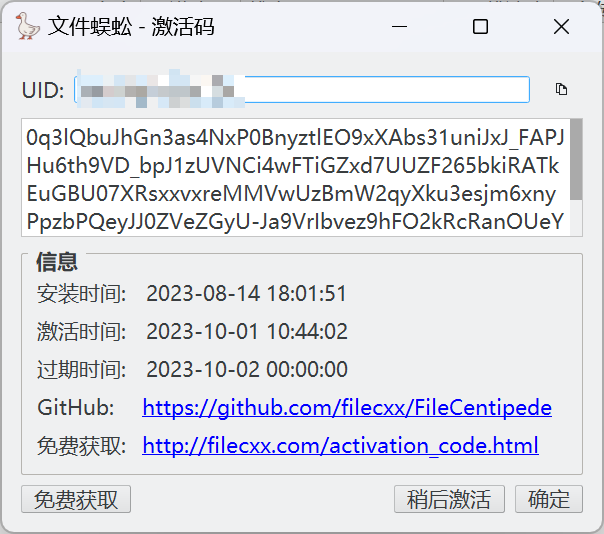
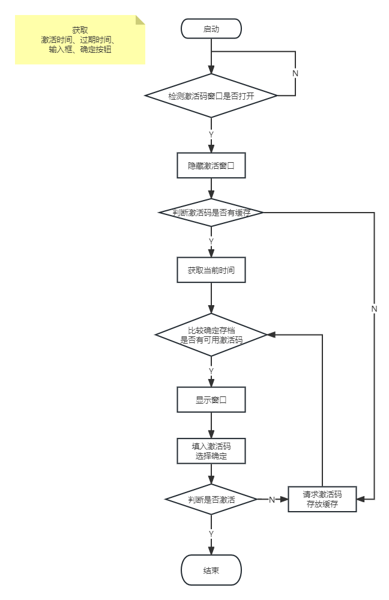

# 文件蜈蚣自动粘贴激活码



## 文件蜈蚣

项目地址：[filecxx/FileCentipede: Cross-platform internet upload/download manager for HTTP(S), FTP(S), SSH, magnet-link, BitTorrent, m3u8, ed2k, and online videos. WebDAV client, FTP client, SSH client. (github.com)](https://github.com/filecxx/FileCentipede)

🥰**记得给文件蜈蚣的作者狠狠的加 star !**

## 功能

自动获取每日激活码，存取到本地数据库，在检测到激活弹窗时，自动填入，自动点击确定，关闭窗口

### 使用方法

双击运行即可

### 注意事项

1. 有时候运行时间久了， 弹窗后不自动填写，双击再次打开填写工具即可；
2. 在激活时不要随意移动鼠标；

## 开发

> 获取源代码自己二次开发即可，基本原理就是获取激活码，复制到剪贴板，粘贴到窗口，关闭窗口

### 环境安装

```SHELL
pip install -r requirements.txt
```

### 原理图



